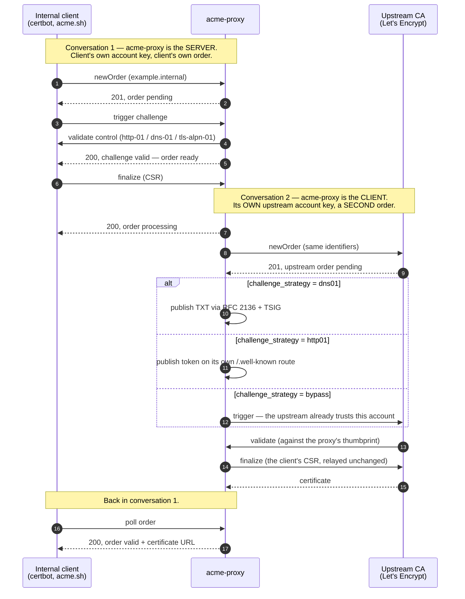

# Relay

The `relay` backend keeps this server answering ACME to its own clients while a
real upstream CA does the signing. It captures internal ACME requests and
fulfils them through an upstream external CA (Let's Encrypt, ZeroSSL, or a
commercial CA).

## How it works

There are **two ACME conversations**, and keeping them apart is the whole trick
to reading this page. `acme-proxy` is the *server* in one and the *client* in
the other. Each has its own account, its own account key, its own order and its
own challenges, and nothing crosses between them.



Two consequences fall straight out of the diagram:

- **The key authorization at the upstream uses the proxy's own thumbprint**,
  never the client's. They are different accounts on different servers, so the
  client could not answer the upstream's challenge even in principle.
- **`finalize` answers `processing`, not `valid`.** Conversation 2 takes as long
  as the upstream takes, so the client polls. `local_ca` and `custom` answer
  inline and never pass through `processing` — see
  [Core Concepts](../core/concepts.md#order).

## Challenge strategies

The strategy names the *one* challenge type the proxy answers upstream. A CA
offers several — Let's Encrypt currently poses four — and every type the
strategy does not name is ignored, including ones this server has no
implementation for at all. Nothing falls back: if the upstream authorization
does not offer the type the strategy names, the relay says so and stops, rather
than trying a type it could not finish.

### `dns01` (RFC 2136 TSIG)
This is the strategy that can prove a wildcard. The proxy intercepts internal
HTTP-01 or DNS-01 challenges, but to satisfy the external CA, the proxy solves
the external DNS-01 challenge itself. It does this using an `rfc2136` provider
powered by `hickory-proto`. It securely authenticates with the DNS server using
TSIG (Transaction Signature) to publish the TXT record. **Note:** The TXT record
uses the thumbprint of the proxy's upstream account key, *not* the internal
client's key.

### `http01`
The proxy answers the upstream's `http-01` challenge by serving the key
authorization itself, from a route on its own root router at
`/.well-known/acme-challenge/<token>`.

Like `dns01`, the value served is derived from **this proxy's** upstream account
thumbprint, not the internal client's — the two are different accounts on
different servers, so the client cannot answer it even in principle. Unlike
`dns01`, the body is the key authorization *verbatim* rather than its SHA-256
digest (RFC 8555 §8.3 versus §8.4).

This is the opposite direction of [the inbound `http-01`
challenge](../challenges/http_01.md), which is this server *validating* its own
clients. The two share the well-known path and nothing else.

Two constraints are worth knowing before choosing it:

- **It needs a forwarder.** `acme-proxy` does not open a second listener and
  does not bind port 80. The upstream CA fetches
  `http://<identifier>:80/.well-known/acme-challenge/<token>`, so something must
  forward or redirect that path to `acme-proxy` — see [Deploying the http-01
  responder](#deploying-the-http-01-responder) below.
- **It cannot prove a wildcard.** Nothing answers HTTP on the name
  `*.example.com`. An upstream authorization for a wildcard is refused with an
  error naming `dns01`, which is the strategy that can.

There is no `[signer.relay.http01]` table: setting `challenge_strategy =
"http01"` is the whole configuration.

### `bypass`
Used when the upstream CA implicitly trusts the proxy's account (e.g., a
commercial CA with pre-validated domains). The proxy simply tells the upstream
"I have validated this", bypassing external challenges entirely.

This is the one strategy that does not name a type: it triggers whatever the
authorization offers. It prefers a challenge it could have satisfied had it
needed to, since an upstream that validates out of band still decides against
the challenge it was pointed at.

## Deploying the http-01 responder

Only relevant with `challenge_strategy = "http01"`.

The upstream CA fetches on port 80 of each name being issued, so put the
existing web server for that name in front of `acme-proxy` and hand it that one
path. Either shape works — RFC 8555 §8.3 explicitly permits following redirects,
and every real CA does, so the target need not share the name:

```nginx
# nginx, on the name being certified. Proxy it:
location /.well-known/acme-challenge/ {
    proxy_pass http://acme-proxy:3000;
}

# ...or just redirect it, which needs no upstream block:
location /.well-known/acme-challenge/ {
    return 301 http://acme-proxy:3000$request_uri;
}
```

```caddy
# Caddy
handle /.well-known/acme-challenge/* {
    reverse_proxy acme-proxy:3000
}
```

```yaml
# Traefik, as a dynamic-configuration router
http:
  routers:
    acme-challenge:
      rule: "PathPrefix(`/.well-known/acme-challenge/`)"
      service: acme-proxy
      priority: 100
  services:
    acme-proxy:
      loadBalancer:
        servers:
          - url: "http://acme-proxy:3000"
```

The route is mounted on the **root** router, beside `GET /health` — it is not
under a profile's `/profile/<name>` prefix, carries no filter chain, mints no
nonce, and answers a plain `404` rather than an ACME problem document for an
unknown token. It exists only while some profile's signer uses this strategy;
with any other backend the path is not routed at all. A
`http_01_responder_mounted` line at startup confirms it is live.

## Configuration

```toml
[signer]
backend = "relay"

[signer.relay]
directory_url = "https://acme-staging-v02.api.letsencrypt.org/directory"
account_key_path = "upstream_account.key"
contact = ["mailto:admin@example.com"]
challenge_strategy = "bypass"
poll_interval_ms = 2000
poll_timeout_secs = 300
```

### Several relaying profiles

`[signer]` is a per-profile section, so one server can relay to several
upstreams at once — a Let's Encrypt endpoint beside a commercial CA, or one
internal CA per environment. Each profile gets its own `[signer.relay]`, and
they must not share an `account_key_path`: two backends over one upstream
account key would overwrite each other's registration, and startup refuses it
by name.

```toml
[profiles.public.signer]
backend = "relay"
relay.directory_url = "https://acme-v02.api.letsencrypt.org/directory"
relay.account_key_path = "public_account.key"

[profiles.partner.signer]
backend = "relay"
relay.directory_url = "https://acme.commercial-ca.example/directory"
relay.account_key_path = "partner_account.key"
```

Two profiles whose `[signer]` sections are byte-for-byte identical share one
backend and one upstream account; anything that differs makes them independent.
See [Profiles](../core/profiles.md) for what else a profile separates.

### Reference

**`directory_url`** (`String`) — *Default: `""` | Env: `ACME_PROXY_SIGNER__RELAY__DIRECTORY_URL`*

The upstream ACME server's directory URL.

> **Starting the server registers an account.** The first `acme-proxy serve`
> with this backend configured contacts `directory_url` and performs
> `newAccount` there, writing the assigned account URL to the `.kid` sidecar.
> There is no confirmation step and no dry-run — merely booting a configuration
> that names a production CA creates a real account at it, and account creation
> is itself rate limited (Let's Encrypt allows 10 per IP address per 3 hours).
> Point `directory_url` at a **staging** endpoint
> (`https://acme-staging-v02.api.letsencrypt.org/directory`) while you are still
> working out a configuration, and switch to production only once it is settled.
> Subsequent starts reuse the `.kid` sidecar and do not contact the upstream.

**`account_key_path`** (`String`) — *Default: `"upstream_account.key"` | Env: `ACME_PROXY_SIGNER__RELAY__ACCOUNT_KEY_PATH`*

Path to this proxy's own account key at the upstream CA. If the file is absent,
an ECDSA P-256 key is generated on startup. The assigned `kid` is stored beside
it with a `.kid` extension.

**`contact`** (`Array`) — *Default: `[]` | Env: `ACME_PROXY_SIGNER__RELAY__CONTACT`*

Optional contacts sent with `newAccount` to the upstream CA.

**`challenge_strategy`** (`String`) — *Default: `"bypass"` | Env: `ACME_PROXY_SIGNER__RELAY__CHALLENGE_STRATEGY`*

How the proxy satisfies the upstream's domain-control checks: `bypass` (the
upstream validates nothing), `dns01` (publish the TXT record the upstream asks
for) or `http01` (serve the challenge file from this server's own root router,
which requires a reverse proxy in front of it and cannot prove a wildcard). Any
other value is a startup error.

**`poll_interval_ms`** (`Integer`) — *Default: `2000` | Env: `ACME_PROXY_SIGNER__RELAY__POLL_INTERVAL_MS`*

How often to poll an upstream order/authorization while it resolves.

**`poll_timeout_secs`** (`Integer`) — *Default: `300` | Env: `ACME_PROXY_SIGNER__RELAY__POLL_TIMEOUT_SECS`*

Total budget (in seconds) for one upstream issuance before the local order is
marked invalid.

### `[signer.relay.dns01]`

Only consulted when `challenge_strategy = "dns01"`.

**`provider`** (`String`) — *Default: `"rfc2136"` | Env: `ACME_PROXY_SIGNER__RELAY__DNS01__PROVIDER`*

DNS provider used to publish the upstream TXT record. `rfc2136` is currently the
only implementation.

Public DNS propagation must succeed before CA validation starts. Missing TXT
answers, resolver errors, and query timeouts cause another query until the
propagation deadline expires. Matching preserves TXT bytes and case.

The configuration settings are:

| Setting | Default | Purpose |
| --- | --- | --- |
| `propagation_resolver` | `"1.1.1.1:53"` | Public resolver IP address and port. |
| `propagation_timeout_secs` | `120` | Maximum propagation wait. |
| `propagation_interval_ms` | `2000` | Delay between queries. |
| `query_timeout_secs` | `5` | Maximum time for each query. |
| `cleanup_timeout_secs` | `120` | Maximum time for two cleanup attempts. |
| `attempt_timeout_secs` | `900` | Maximum time for the complete DNS relay attempt. |

Environment variables use `ACME_PROXY_SIGNER__RELAY__DNS01__` with the
uppercase setting name. Seconds must be 1 through 86400. The query interval
must be 1 through 60000 milliseconds.

The propagation resolver must return public answers. The proxy does not use
`dns.resolver`, system DNS, or the UPDATE server for this check. Its local
resolver cache is disabled. The public resolver can cache positive and negative
answers with DNS TTL rules. Configure a different public resolver if necessary.

The attempt limit must be more than the sum of UPDATE, propagation, validation,
and cleanup limits. The validation limit is `poll_timeout_secs`. With defaults,
these limits total 600 seconds. The 900-second attempt limit includes all
identifiers and certificate retrieval. Increase it for large orders. The relay
job uses this attempt limit and also stops at the order deadline.

Cleanup removes only the attempt's TXT value after success, propagation failure,
or validation failure. A worker finishes an in-flight UPDATE before cleanup when
the caller is cancelled. Cleanup can continue after the attempt deadline. Its
maximum time is the UPDATE limit plus the cleanup limit. A retry with the same
value waits for this worker. This coordination applies in one proxy process.

TXT records can stay after process termination. Cleanup failures keep the
primary failure and cause a log event. Removal of a missing value succeeds.

### `[signer.relay.dns01.rfc2136]`

The address, zone, and key settings are necessary for the `dns01` strategy.

**`server`** — *Env: `ACME_PROXY_SIGNER__RELAY__DNS01__RFC2136__SERVER`*
`host:port` of the nameserver accepting the dynamic update, e.g. `10.0.0.53:53`.
This is the update target, distinct from `dns.resolver`, which governs
*lookups*.

**`zone`** — *Env: `ACME_PROXY_SIGNER__RELAY__DNS01__RFC2136__ZONE`*
The zone the update is sent for, fully qualified with a trailing dot, e.g.
`internal.company.com.`.

**`tsig_key_name`** — *Env: `ACME_PROXY_SIGNER__RELAY__DNS01__RFC2136__TSIG_KEY_NAME`*
Name of the TSIG key the update is signed with.

**`tsig_key_secret`** — *Env: `ACME_PROXY_SIGNER__RELAY__DNS01__RFC2136__TSIG_KEY_SECRET`*
The TSIG shared secret, in **standard** base64 — note this differs from EAB
secrets, which are base64url. A value that is not valid base64 is a **startup
error**, not a runtime one. This key is legitimately long-lived, so unlike a
one-shot EAB credential it belongs in configuration; still prefer the
environment variable over a file on disk.

**`tsig_algorithm`** — *Env: `ACME_PROXY_SIGNER__RELAY__DNS01__RFC2136__TSIG_ALGORITHM`*
The TSIG algorithm, e.g. `hmac-sha256`. Must match the key as your nameserver
defines it.

**`timeout_secs`** — *Default: `60` | Env: `ACME_PROXY_SIGNER__RELAY__DNS01__RFC2136__TIMEOUT_SECS`*
Maximum time for one UPDATE with UDP and TCP fallback. The permitted
range is 1 through 3600 seconds. The cleanup limit must cover this limit.

The proxy accepts UDP responses only from the configured server. It checks
response TSIG against the request MAC, configured key, algorithm, and time
window before it accepts status. The maximum time difference is 300 seconds.
The response must also have the correct ID, response type, and UPDATE opcode.

An authenticated truncated UDP response is necessary for TCP fallback.
An unsigned or
invalid truncated response fails the operation. The TCP response must have its
own correct TSIG and must not be truncated. UDP and TCP share one deadline.

### `[signer.relay.eab]`

An upstream External Account Binding credential supplied in configuration
rather than through `acme-proxy upstream register`. Both keys are empty by
default, which means "no configuration-file credential". Read only by
`acme-proxy serve`, and only on a startup that finds no `.kid` sidecar beside
`account_key_path` — see [EAB considerations](#eab-considerations) below for
which of the two mechanisms to prefer.

**`kid`** (`String`) — *Default: `""` | Env: `ACME_PROXY_SIGNER__RELAY__EAB__KID`*

The key id the upstream's operator issued alongside the secret.

**`hmac_key`** (`String`) — *Default: `""` | Env: `ACME_PROXY_SIGNER__RELAY__EAB__HMAC_KEY`*

**Sensitive.** The shared secret, in base64 — url-safe, unpadded url-safe or
standard are all accepted, the same three forms `acme-proxy upstream register`
takes. A value that decodes as none of them is a **startup error**, as is
setting either key without the other. Prefer the environment variable to a file
on disk, and clear it once registration has succeeded: while it stays non-empty
the server logs a `signer_relay_eab_secret_in_config` warning on every startup.

## EAB considerations
An External Account Binding (EAB) credential is a one-time use token that
authorizes a single `newAccount` request and is useless afterwards —
registration itself only ever runs once, guarded by the `.kid` sidecar that ends
up next to `account_key_path`. There are two ways to supply it:

**The Admin CLI**, registering the proxy with the upstream CA out of band:
```bash
acme-proxy upstream register --profile prod --eab-kid "..." --eab-hmac-key-file /path/to/secret
```
The secret may also be piped on stdin. It is never accepted as a command-line
argument, because argv is visible to every user on the host via `ps`. Nothing
about this credential is ever written to disk — only the resulting account `kid`
persists.

`--profile` is required whenever the configuration defines more than one
profile: `[signer]` is a per-profile section, so registering "the upstream"
without saying which one would be registering nothing.

**`[signer.relay.eab]` in configuration**, read by `acme-proxy serve`
itself on the first startup with no `.kid` sidecar yet:
```toml
[signer.relay.eab]
kid = "..."
hmac_key = "..."   # base64: url-safe, unpadded url-safe, or standard
```
This is the trade-off the CLI path exists to avoid: a bootstrap secret sitting
in configuration for the life of the server, in exchange for not needing a
separate imperative step — useful when `config.toml` is already populated by a
secrets manager or a templated deployment. Once registration succeeds, `serve`
logs a `signer_relay_eab_secret_in_config` warning on **every** startup for
as long as `hmac_key` stays non-empty, the same treatment `challenge.bypass` and
`ipam.netbox.insecure_skip_verify` get — clear it out once `acme-proxy
upstream show` confirms a `kid` is stored. Setting `kid` without `hmac_key`, or
vice versa, is a startup error.

If the upstream requires EAB and neither mechanism supplies a working
credential, `acme-proxy serve` fails at startup naming both.

The outbound client validates the upstream's TLS certificate against
`webpki-roots` — unlike `challenge.http_01`, which deliberately does not
validate the responder's certificate. Here the certificate is the only thing
identifying the CA being handed your CSRs.
